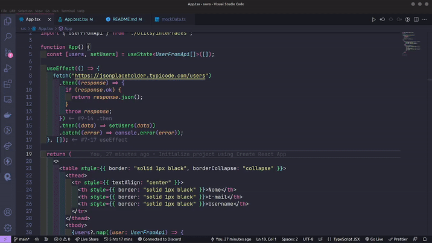

## jest-fetch-mock with React & TypeScript

Mocking API calls in React Components using [jest-fetch-mock](https://www.npmjs.com/package/jest-fetch-mock).

  

### Authors:

- [Mayra Amaral](https://github.com/mayraamaral);
- [Ádisson Téjo](https://github.com/adissontejo);
